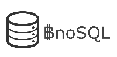

**BnoSQL**  *Blockchain NoSQL* 
 > WIP

A NoSQL document based DB ecosystem based on blockchain technology.
Using different approaches to solve eficiency problems, our ecosystem provide Layer-1 and Layer-2 solutions, bringing **integrity** and **disponibility** to your NoSQL DB, besides the optimizations to provide a **low cost**.

With our solution, you can built your database on top of an Ethereum blockchain or on top of **our own blockchain**.
**Public or Private** blockchains can be used with data encryption to provide  **confidentiality** to your data. 
Our **sidechain** solution speed up transactions, making it a real tool for real world applications.

>### Ecosystem 

- Blockchain

Our blockchain software - Your can host it yourself (private), or use an public (DBaaS) service runing our blockchain. Transactions are paid with **BnoSQL** token.

- Interface - library

Multiple programing languages interfaces - It can connect to our blockchain software (public or private) or an Ethereum blockchain.

- DBaaS

As part of our ecossystem, we mantain our own blockchain DBaaS.

>### Programming Languages

Our Python implementation is done and we are working on NodeJS and Java implementation. Other languages are in our roadmap (Ruby, PHP, ASP.NET, etc.)

|Language| Status | % |
|--|--|--|
| Python | Done | 100%
| Node.js | WIP | 60%
| Java | WIP | 40%
| Ruby | - | 0%
| PHP | - | 0%
| ASP.NET | - | 0%

> ### Opensource

Every piece of our code will be published as opensource when we launch it.
Our ecosystem is already done and we are currently working on some details about the launching. 

>### BnoSQL Token

**BnoSQL** token will be used to pay (gas) transactions between your system and the blockchain service (DBaaS).

It is a BEP-20 token developed on BSC (Binance Smart Chain).

Contract Address:

    0xc6588e3b5F705AFA2c8Ec64C375f81c2B954cBFa

Every transaction will pay a 1% fee. It will be transfered to the project wallet (0x9078105264658E4838347Eeb6bbC32d9247a7E8f) and will be used to mantain the project development and infrastructure.

        
>### About

We will publish our roadmap very soon.

>### Donate

If you want to help our project, please donate **BnoSQL** or **BNB** to our project wallet:
	
	0x9078105264658E4838347Eeb6bbC32d9247a7E8f
